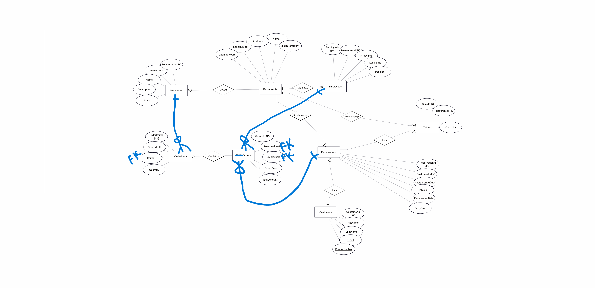

#### Entity Relationship Model (ERM) Diagram

# Restaurant Reservation System

## Project Description
This project manages restaurants, customers, reservations, orders, employees, and menu items.
It allows users to reserve tables, create orders, and generate reports.

## Database Schema
The database contains:

- Restaurants:
  Stores restaurant information like name and phone number.

- Employees:
  Stores employee information and their positions.

- Customers:
  Stores customer details.

- Reservations:
  Stores table reservations made by customers.

- Tables:
  Stores restaurant tables and their capacity.

- Orders:
  Stores customer orders related to reservations.

- MenuItems:
  Stores available food items.

- OrderItems:
  Connects orders with menu items.

## Queries and Procedures Explanation

### 1. Popular Menu Item Analysis
Purpose:
Find the most ordered menu item for each restaurant in a specific month.

Why:
Used JOINs to connect orders, reservations, restaurants, and menu items.
Used Window Function (ROW_NUMBER) to rank menu items.

### 2. Calculate Employee Salary Function
Purpose:
Calculate employee salary based on number of orders and employee position.

Formula:
Salary = Number of Orders × Employee Rank

Rank:
VIPOrdersWaiter = 5
StandardWaiter = 4
AssistantWaiter = 3

### 3. Add New Order Procedure
Purpose:
Insert a new order after checking that the reservation and employee exist.

Why:
Prevents invalid data and maintains database integrity.

### 4. Reservation Audit Trigger
Purpose:
Automatically save reservation changes into AuditLog.

Why:
Keeps history of reservations for tracking changes.

### 5. Non-Clustered Index
Purpose: Improve query performance by speeding up searching, filtering, and joining operations.